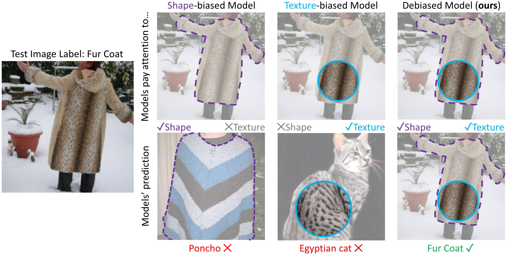

# Shape-Texture Debiased Neural Network Training
Code and models for the paper [Shape-Texture Debiased Neural Network Training](https://arxiv.org/pdf/2010.05981.pdf) (ICLR 2021).

## Introduction
<div align="center">
  
</div>

Convolutional Neural Networks are often biased towards either texture or shape, depending on the training dataset [(Geirhos et al. 2019)](https://arxiv.org/pdf/1811.12231.pdf).
Our ablation shows that such bias degenerates model performance. 
Motivated by this observation, we develop a simple algorithm for shape-texture debiased learning.
 
Experiments show that our method successfully improves model performance on several image recognition benchmarks and adversarial robustness.
For example, by training on ImageNet, it helps ResNet-152 achieve substantial improvements on ImageNet (+1.2%), ImageNet-A  (+5.2%), ImageNet-C (+8.3%) and Stylized-ImageNet (+11.1%), and on defending against FGSM adversarial attacker on ImageNet (+14.4%). 
Our method also claims to be compatible to other advanced data augmentation strategies, eg, Mixup and CutMix.

## Dependencies:

+ PyTorch = 1.4.0 with GPU support


## Model Zoo:

| Shape-Texture Debiased Models  | ImageNet (Top-1 Acc.)  |
|:------------------------------------:|:---------------------:|
| ResNet-50 [:arrow_down:](https://livejohnshopkins-my.sharepoint.com/:u:/g/personal/yli286_jh_edu/Ecfve0hAi8hJlOkyBnVfHYYBNOl9ibeqbxwviGWc253FXA?e=tocnjL)                            | 76.9                  |
| ResNet-101 [:arrow_down:](https://livejohnshopkins-my.sharepoint.com/:u:/g/personal/yli286_jh_edu/ESdVdWHZ7IxHtQtxOC0Ib_kBC44ewmWTwFmh75AWisdwsA?e=nSGmmV)                           | 78.9                  |
| ResNet-152 [:arrow_down:](https://livejohnshopkins-my.sharepoint.com/:u:/g/personal/yli286_jh_edu/ERnbFlP0kTdIgkwvhp_R5xEBuvYNhwJTF0lUkN1htQPyng?e=NBhirF)                           | 79.8                  |
| Mixup-ResNeXt-101 [:arrow_down:](https://livejohnshopkins-my.sharepoint.com/:u:/g/personal/yli286_jh_edu/ETkK-viSjr1DnwybWdJAxQ0BeyguIoJhaWQBqTL5NbShGw?e=SHiJx2)                    | 80.5                  |
| CutMix-ResNeXt-101 [:arrow_down:](https://livejohnshopkins-my.sharepoint.com/:u:/g/personal/yli286_jh_edu/ERtU5qtTag1MtBS4RHZ5Y2EBuKMs0dxnvWSj35tOumRO3Q?e=WKPLK5)                   | 81.2                  |

## Training & Testing:
Please see the [Training recipes](TRAINING.md) / [Testing recipes](TESTING.md) for how to train / test the models.

# Acknowledgements
Part of this code comes from [pytorch-classification](https://github.com/bearpaw/pytorch-classification) and [AdaIN](https://github.com/naoto0804/pytorch-AdaIN).

# Citation
If you use our code, models or wish to refer to our results, please use the following BibTex entry:
```
@article{li2020shapetexture,
  author  = {Li, Yingwei and Yu, Qihang and Tan, Mingxing and Mei, Jieru and Tang, Peng and Shen, Wei and Yuille, Alan and Xie, Cihang},
  title   = {Shape-Texture Debiased Neural Network Training},
  journal = {arXiv preprint arXiv:2010.05981},
  year    = {2020}
}
```
